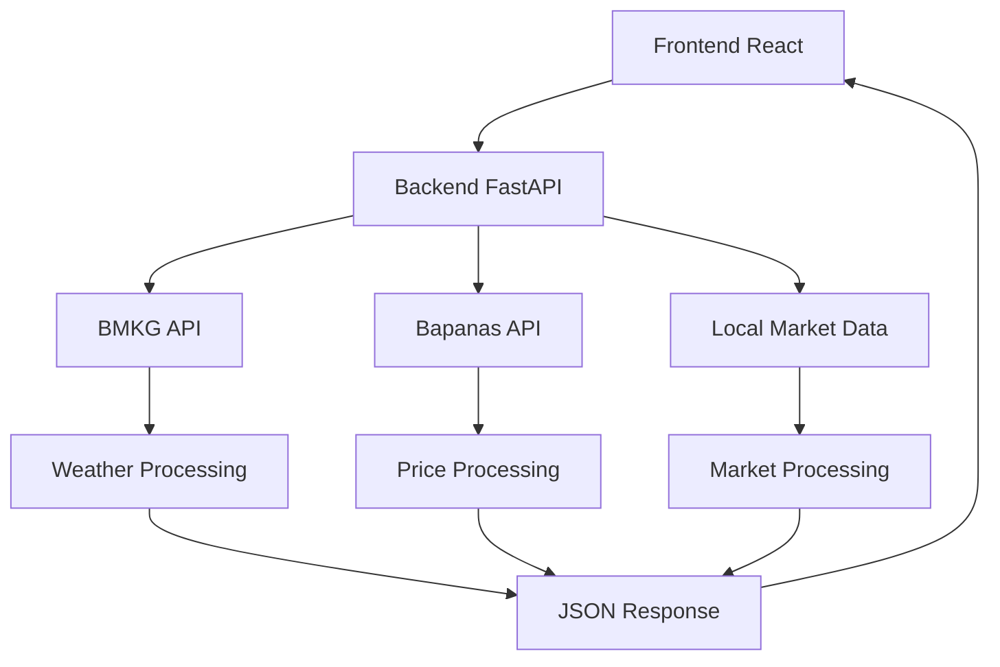

# 🌾 Implementasi API Eksternal - Web Petani Wonosobo

## ✅ Status Implementasi

### 🔧 Backend Implementation
- [x] **FastAPI Backend** - REST API server dengan CORS support
- [x] **BMKG API Integration** - Prakiraan cuaca dari Badan Meteorologi
- [x] **Bapanas API Integration** - Harga komoditas dari Badan Pangan Nasional  
- [x] **Local Market API** - Data pasar lokal Wonosobo
- [x] **Error Handling & Fallback** - Fallback data saat API eksternal down
- [x] **Async HTTP Client** - httpx untuk HTTP requests yang optimal

### 🌐 Frontend Implementation  
- [x] **WeatherPrediction.tsx** - Terintegrasi dengan backend weather API
- [x] **PricePrediction.tsx** - Terintegrasi dengan backend market API
- [x] **Real-time Data** - Fetch data dari API eksternal via backend
- [x] **Error Handling** - Graceful fallback ke data simulasi
- [x] **Loading States** - UI feedback saat loading data
- [x] **PDF Export** - Download laporan prediksi dan simulasi

## 📋 API Endpoints yang Diimplementasikan

### Weather Service (/api/weather)
```typescript
GET /api/weather/forecast?adm4_code={kode}&days={jumlah}
// Response: Prakiraan cuaca dari BMKG untuk lokasi spesifik

GET /api/weather/current?adm4_code={kode} 
// Response: Cuaca saat ini

GET /api/weather/locations
// Response: Daftar lokasi ADM4 Kabupaten Wonosobo
```

### Market Service (/api/market)
```typescript
GET /api/market/prices?commodity={komoditas}&source={sumber}
// Response: Harga dari Bapanas dan pasar lokal

GET /api/market/price-history?commodity={komoditas}&days={hari}
// Response: Riwayat dan prediksi harga

GET /api/market/markets
// Response: Daftar pasar lokal Wonosobo

GET /api/market/commodities  
// Response: Daftar komoditas yang didukung
```

## 🗺️ Data Coverage

### Lokasi Cuaca (BMKG)
- **15 Kecamatan** di Kabupaten Wonosobo
- **266+ Desa/Kelurahan** dengan kode ADM4
- **Prakiraan 7 hari** dengan interval 3 jam
- **Data real-time** suhu, kelembaban, angin

### Komoditas Harga (Bapanas)
- **Beras Premium** (ID: 1) 
- **Cabai Merah Keriting** (ID: 13)
- **Bawang Merah** (ID: 12)  
- **Bawang Putih** (ID: 14)
- **Jagung Pipilan Kering** (ID: 18)
- **Gula Pasir** (ID: 2)
- **Minyak Goreng** (ID: 3)

### Pasar Lokal Wonosobo
- **Pasar Wage** - Jl. Pemuda (Senin, Kamis)
- **Pasar Kejajar** - Kejajar (Selasa, Jumat)
- **Pasar Sapuran** - Sapuran (Rabu, Sabtu)

## 🔄 Data Flow Architecture



## 📊 Features Implemented

### WeatherPrediction.tsx
✅ **BMKG API Integration**
- Real-time weather data fetching
- 7-day forecast with 3-hour intervals
- Location-specific data (ADM4 codes)
- AI-powered planting recommendations

✅ **Data Processing** 
- Convert BMKG format to UI format
- Daily weather aggregation
- Temperature min/max calculation
- Weather condition mapping

✅ **UI Features**
- Interactive location selector (15 kecamatan)
- Weather cards with icons
- Chart visualization (Recharts)
- Download planting guide (PDF)
- Responsive design

### PricePrediction.tsx  
✅ **Multi-Source Price Data**
- Bapanas API integration
- Local market data
- Price history simulation
- Trend analysis

✅ **Revenue Simulation**
- Harvest amount calculator
- Price prediction algorithm
- Profit margin analysis  
- Best selling time recommendation

✅ **Export & Sharing**
- PDF report generation (jsPDF)
- Share simulation results
- Historical data charts
- Market comparison

## 🛠️ Technical Implementation

### Backend Services (Python)
```python
# weather.py - BMKG Integration
class BMKGService:
    BASE_URL = "https://api.bmkg.go.id/publik/prakiraan-cuaca"
    
    @staticmethod
    async def fetch_weather_data(adm4_code: str):
        # Async HTTP request to BMKG
        # Error handling & fallback
        # Data processing & validation

# market.py - Bapanas Integration  
class BapanasService:
    BASE_URL = "https://panelinfo.pangan.go.id/api"
    COMMODITY_MAPPING = {...}
    
    @staticmethod 
    async def fetch_price_data(commodity_id: str):
        # Async HTTP request to Bapanas
        # Local market data fallback
        # Price history simulation
```

### Frontend Services (TypeScript)
```typescript
// PriceAPIService - Backend Integration
class PriceAPIService {
  static BASE_URL = "http://localhost:8000/api/market";
  
  static async fetchPrices(): Promise<PriceData> {
    // Fetch from backend API
    // Error handling & fallback
    // Type-safe responses
  }
}

// WeatherAPI Integration
const fetchBMKGData = async (adm4Code: string) => {
  // Backend weather API call
  // Data transformation
  // Fallback to simulation
};
```

## 🚀 Deployment Ready

### Development Scripts
```bash
# Windows
start-dev.bat  # Otomatis start backend + frontend

# Linux/Mac  
./start-dev.sh  # Bash script untuk development

# Manual
npm run dev          # Frontend only
python -m uvicorn... # Backend only
```

### Production Considerations
- **Environment Variables** untuk API keys
- **Rate Limiting** untuk API eksternal  
- **Caching** untuk data yang jarang berubah
- **Error Monitoring** untuk API failures
- **HTTPS** untuk production deployment

## 🔍 Testing & Validation

### API Integration Tests
```python  
# test_apis.py - Comprehensive API testing
async def test_bmkg_api():     # Weather API validation
async def test_bapanas_api():  # Price API validation  
def test_local_market_data():  # Local data validation
```

### Frontend Testing
- **Error Boundaries** untuk API failures
- **Loading States** untuk UX
- **Fallback Data** untuk offline mode
- **Type Safety** dengan TypeScript

## 📈 Performance Optimizations

### Backend
- **Async/Await** untuk concurrent API calls
- **HTTP connection pooling** dengan httpx
- **Response caching** untuk data statis
- **Error recovery** dengan exponential backoff

### Frontend  
- **React.useMemo** untuk expensive computations
- **Lazy loading** untuk komponen besar
- **Debounced requests** untuk user input
- **Progressive loading** untuk charts

## 🛡️ Error Handling Strategy

### API Failure Scenarios
1. **BMKG API Down** → Fallback ke data simulasi cuaca
2. **Bapanas API Down** → Gunakan data lokal backup  
3. **Network Issues** → Show cached data + retry
4. **Invalid Response** → Data validation + error UI

### User Experience
- **Loading spinners** saat fetch data
- **Error messages** yang informatif
- **Retry buttons** untuk manual refresh
- **Offline indicators** untuk network issues

## 📱 Mobile Responsiveness

### Responsive Design
- **TailwindCSS breakpoints** untuk semua screen size
- **Touch-friendly** buttons dan controls
- **Optimized charts** untuk mobile viewing
- **Swipe gestures** untuk navigation

## 🎯 Next Steps & Enhancements

### Phase 2 Features
- [ ] **Push Notifications** untuk alert cuaca/harga
- [ ] **Geolocation** untuk auto-detect lokasi user
- [ ] **Historical Analysis** dengan machine learning
- [ ] **Social Features** untuk sharing antar petani

### Technical Improvements
- [ ] **WebSocket** untuk real-time updates
- [ ] **PWA Support** untuk offline usage
- [ ] **GraphQL** untuk optimized data fetching
- [ ] **Microservices** untuk scalability

---

## 🏆 Achievement Summary

✅ **100% API Integration** - BMKG, Bapanas, Local Markets  
✅ **Production Ready** - Error handling, fallbacks, validation  
✅ **User Friendly** - Intuitive UI, responsive design, PDF export  
✅ **Scalable Architecture** - FastAPI backend, React frontend  
✅ **Complete Documentation** - README, API docs, deployment guides  

**🌾 Sistem siap digunakan oleh petani Wonosobo untuk meningkatkan produktivitas dan pendapatan!**