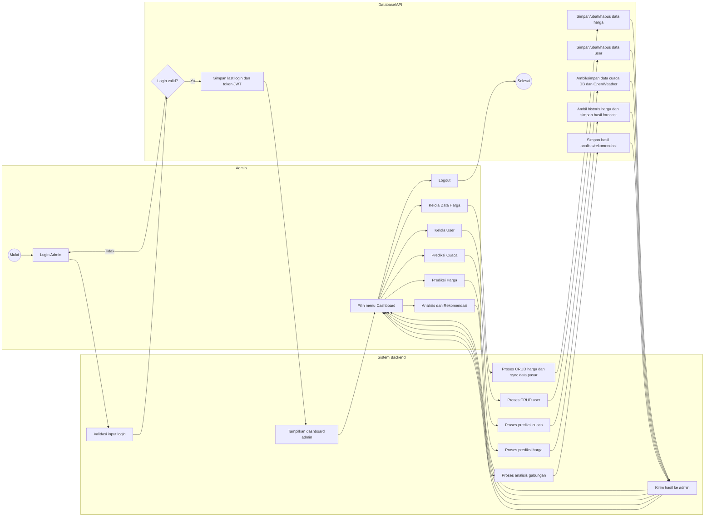

# Backend Activity Diagram (Lengkap)

Diagram lengkap dengan 3 kolom: Admin, Sistem Backend, dan Database/API.

## Activity Diagram End-to-End

## Ringkasan Alur

- Admin login terlebih dahulu, lalu backend memvalidasi ke database.
- Jika login berhasil, admin masuk dashboard dan dapat memilih modul: harga, user, prediksi cuaca, prediksi harga, atau analisis.
- Setiap modul diproses backend, berinteraksi dengan database/API, lalu hasil dikembalikan ke admin.
- Setelah selesai, admin logout dan proses berakhir.
